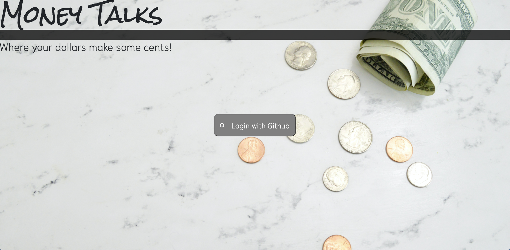
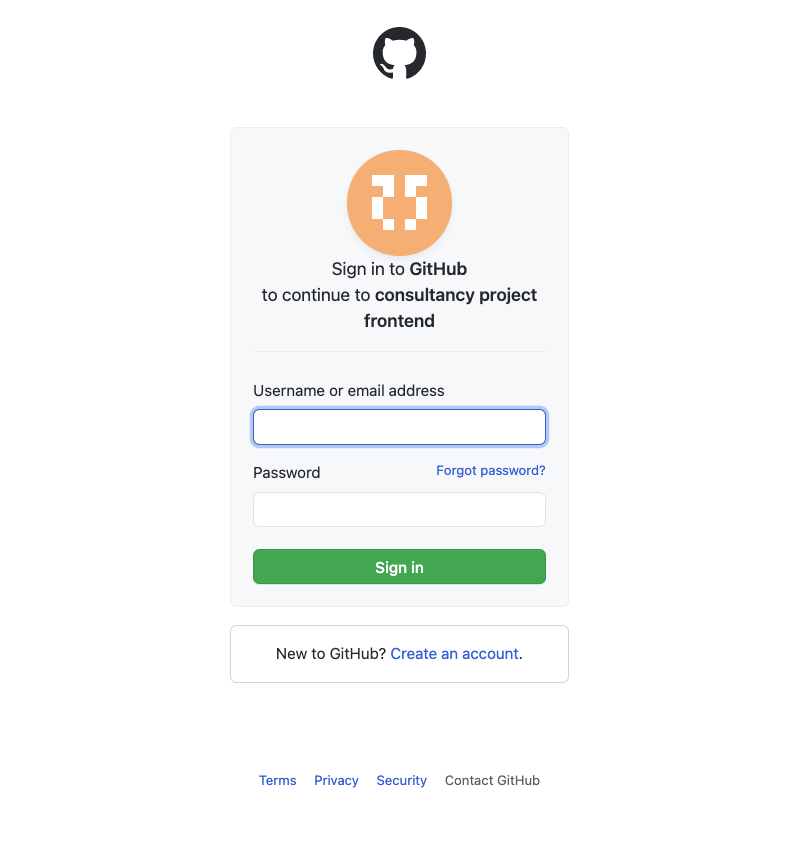
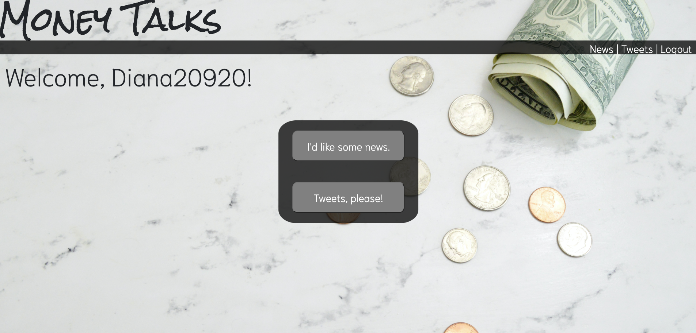
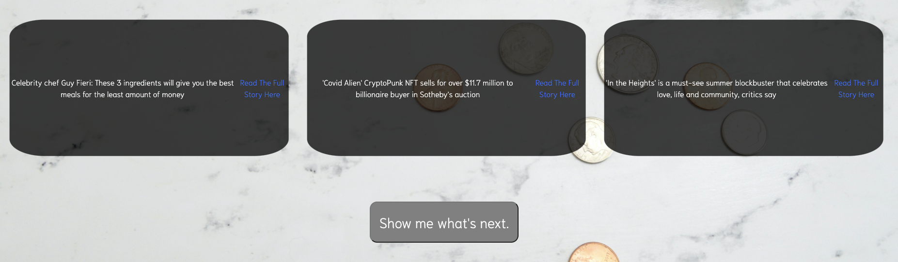
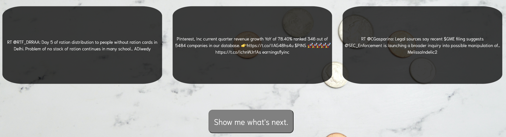

# Front End
    ___  ___                         _____     _ _        
    |  \/  |                        |_   _|   | | |       
    | .  . | ___  _ __   ___ _   _    | | __ _| | | _____
    | |\/| |/ _ \| '_ \ / _ \ | | |   | |/ _` | | |/ / __|
    | |  | | (_) | | | |  __/ |_| |   | | (_| | |   <\__ \
    \_|  |_/\___/|_| |_|\___|\__, |   \_/\__,_|_|_|\_\___/
                              __/ |                       
                             |___/                        

## About this Project
The goal of this project is to create a successful web application from a student-led project idea. Our team has created an app that solves a real world problem, and allows users to authenticate with a third-party service, and consume at least two other apis.

## Table of Contents

  - [Authors](#authors)
  - [Local Setup](#local-setup)
  - [Front End Repo](#other-repos)
  - [Running the tests](#running-the-tests)
  - [Pages](#pages)
  - [Technologies](#technologies)
  - [Versioning](#versioning)
  - [Contributing](#contributing)

## Authors
Alexander Brueck – [Github](https://github.com/brueck1988) • [LinkedIn](https://www.linkedin.com/in/brueck1988/)

Aidan McGuire - [Github](https://github.com/A-McGuire) • [LinkedIn](https://www.linkedin.com/in/aidanmcguire)

Diana Buffone - [Github](https://github.com/Diana20920) • [LinkedIn](https://www.linkedin.com/in/dianabuffone/)

Jahara Clark - [Github](https://github.com/jaharaclark/) • [LinkedIn](https://www.linkedin.com/in/jaharaclark/)

George Ho - [Github](https://github.com/georgehwho) • [LinkedIn](https://www.linkedin.com/in/georgehwho/)

## Local Setup
1. Fork and Clone the repo
2. Install gem packages: `bundle install`
3. Setup the database: `rails db:{drop,create,migrate}`

## Back-End Repo
- Money Talks Back-End Application
  - [Repo](https://github.com/Consultancy-Project/consultancy-backend) | [Heroku](https://be2102-consultancy-project-be.herokuapp.com/)

### Prerequisites
To run this application you will need Ruby 2.5.3 and Rails 5.2.6

## Running the tests
RSpec testing suite is utilized for testing this application.
- Run the RSpec suite to ensure everything is passing as expected  
`bundle exec rspec`

## Pages

### Home Page

### Logging-In

### Logged-In User

### News Path: `https://be2102-consultancy-project-be.herokuapp.com/api/v1/news`

### Tweets Path: `https://be2102-consultancy-project-be.herokuapp.com/api/v1/tweets`

## Technologies
Project is created with:
* Ruby version 2.5.3
* Rails version 5.2.6
* RSpec
* Capybara
* SimpleCov
* Travis CI
* Heroku

## Versioning
- Ruby 2.5.3
- Rails 5.2.6

## Contributing
1. [Fork it](<https://github.com/Consultancy-Project/consultancy-backend/fork>)
2. Create your feature branch (`git checkout -b feature/fooBar`)
3. Commit your changes (`git commit -am 'Add some fooBar'`)
4. Push to the branch (`git push origin feature/fooBar`)
5. Create a new Pull Request
